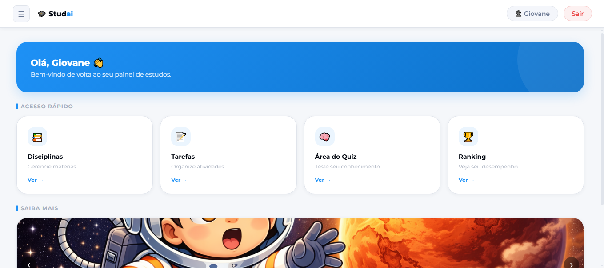
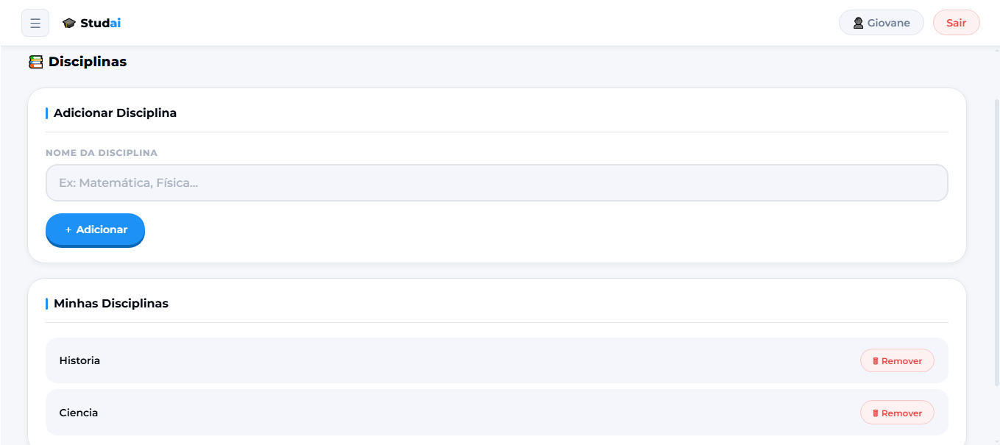
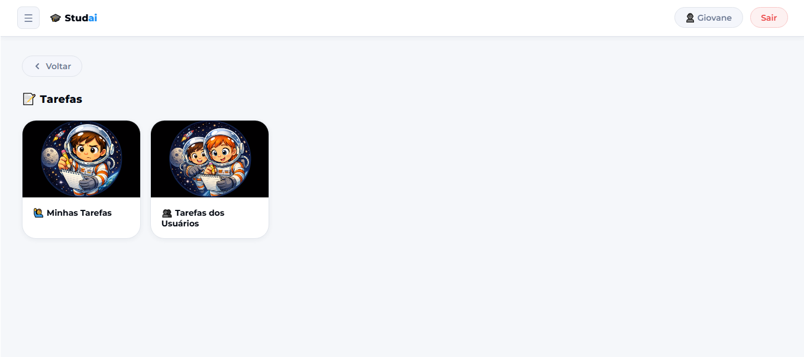
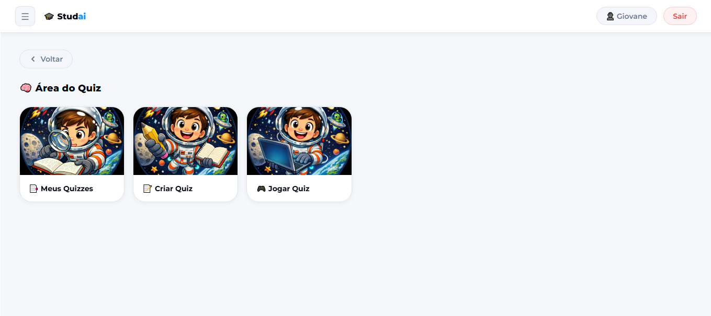
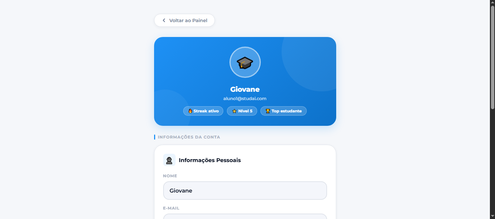
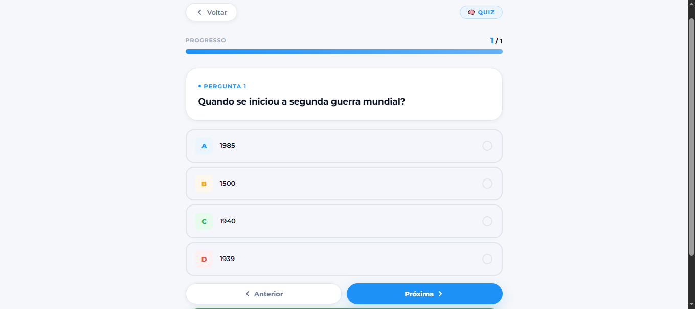
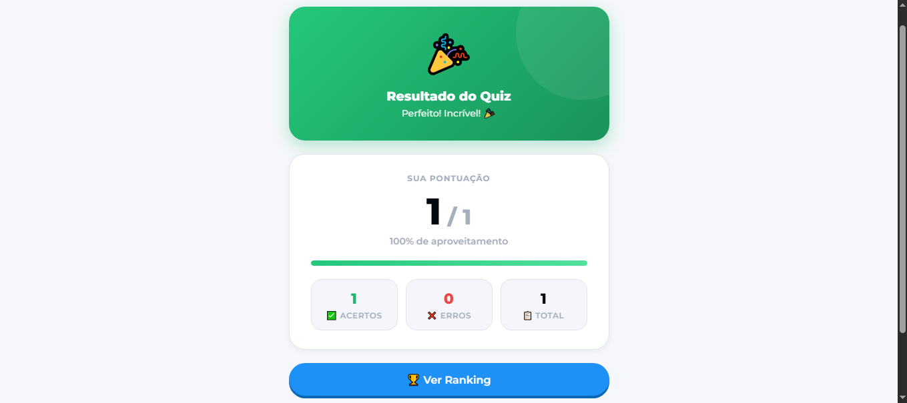

## STUDAI — Plataforma de Estudos Cooperativa

O STUDAI é uma plataforma de estudos desenvolvida com o objetivo de auxiliar alunos na organização da rotina de aprendizagem, acesso a conteúdos, resolução de atividades e acompanhamento do desempenho.

Este projeto representa minha evolução na área de tecnologia e análise de sistemas, envolvendo ideias de organização de dados, experiência do usuário, estruturação de telas e funcionalidades voltadas para educação.

## Funcionalidades planejadas
* Área de acesso para alunos;
* Organização de conteúdos por disciplina;
* Simulados e atividades;
* Acompanhamento de desempenho;
* Interface simples e intuitiva;
* Apoio ao processo de aprendizagem.

## Prints do projeto

### Tela inicial / Login

### Dashboard

### Área de Disciplinas

### Tarefas

### Área dos Quizzes

### Área do Usuário

### Quiz funcionando

### Resultado do Quiz

## Status do projeto
🚧 Projeto em desenvolvimento
📚 Criado como parte da minha jornada de aprendizado em tecnologia e Análise de Sistemas.
